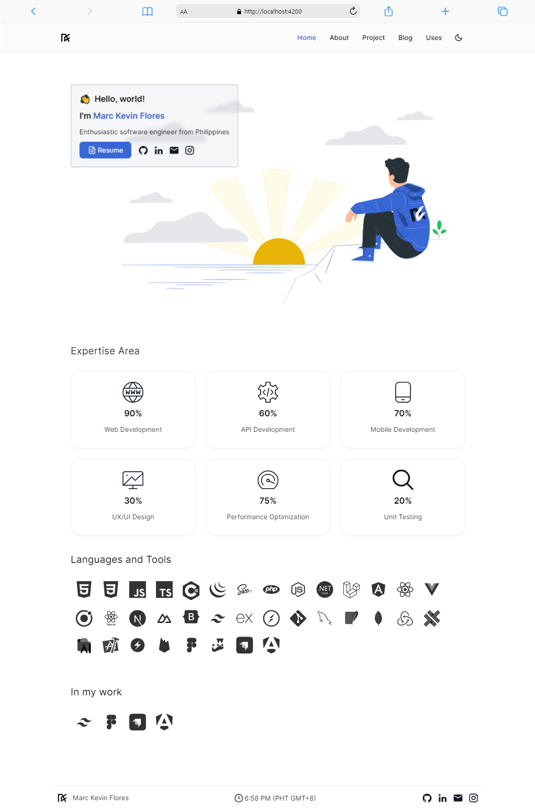

# [kevinflor.es](https://kevinflor.es)


<picture>
  <source media="(prefers-color-scheme: dark)" srcset="./preview-dark.png">
  <source media="(prefers-color-scheme: light)" srcset="./preview.png">
  
</picture>

## Stack
- **Framework**: [Angular](https://angular.dev/)
- **Styling**: [Tailwind CSS](https://tailwindcss.com/)
- **Deployment**: [AWS S3](https://aws.amazon.com/s3/)

## Features 📋
⚡️ Navbar Glassmorphism\
⚡️ Toolbar Color Theme Selector\
⚡️ Light and Dark Mode\
⚡️ Spotlight Glow Hover Card\
⚡️ Devicon with Tooltip\
⚡️ Spotify Music API\
⚡️ Trakt Watch API

## Sections 📚
✔️ Intro Image\
✔️ Expertise Area\
✔️ Languages and Tools\
✔️ In my work\
✔️ About\
✔️ Projects\
✔️ Uses


## Running Locally

This application requires Node.js v18.13+.

```bash
npm install -g @angular/cli
git clone https://github.com/marckevinflores/kevinflor.es.git
cd kevinflor.es
npm install
```

Before starting the application, you need to rename the files inside the `src/environments` directory. Remove the `.bak` file extension from `environment.ts.bak` and `environment.development.ts.bak`. Then run:
```bash
 npm start
```

Wait to compile and go to http://localhost:4200 after compile finish


## Previous versions

my previous versions of this website can be found at [marckevinflores/prev-websites](https://github.com/marckevinflores/prev-websites)
